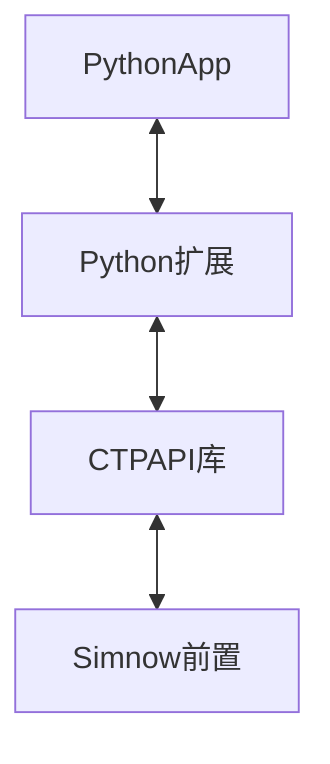

<p align="center">               
    <a href="https://pypi.org/project/openctp-ctp-6315" target="_blank">                  
             
    </a>     
    <a href="https://pypi.org/project/openctp-ctp-6319" target="_blank">                           
                  
    </a>
    <a href="https://pypi.org/project/openctp-ctp-651" target="_blank">                                    
                       
    </a> 
    <a href="https://pypi.org/project/openctp-ctp-661" target="_blank">                                             
                            
    </a> 
    <a href="https://pypi.org/project/openctp-ctp-667" target="_blank">                                             
                            
    </a> 
    <a href="https://pypi.org/project/openctp-ctp-669" target="_blank">                                             
                            
    </a> 
</p>

<p align="center">     
    <a href="http://www.sfit.com.cn/5_2_DocumentDown_6.htm" target="_blank">
        
    </a>
    <a href="#">         
             
    </a>
    <a href="#">                  
                  
    </a>
</p>

<p align="center">          
    <em>以 Python 的方式，简化对接 CTPAPI 的过程，节省精力，快速上手</em>  
</p>

## 安装:hammer_and_wrench:

CTPAPI 6.6.7

```shell
pip install openctp-ctp-667
```

## 代码示例:man_technologist:

- 行情 [demo](demo/mdapi.py)
- 交易 [demo](demo/tdapi.py)

## 主要特性:rocket:

- 支持多版本 CTPAPI
    - 6.3.15_20190220
    - 6.3.19_P1_20200106
    - 6.5.1_20200908
    - 6.6.1_P1_20210406
    - 6.6.7_20220613
    - 6.6.9_20220920
- 支持多版本 Python (3.7 ~ 3.11)
- 支持多平台
    - Windows_x64
    - Linux_x64
    - Mac_x64 (支持行情)

## 思路:art:

利用 [SWIG](https://www.swig.org/)及CTPAPI库生成Python扩展库,
转换流程主要参考[Python-CTPAPI](https://github.com/nicai0609/Python-CTPAPI)

感谢:pray:[Ralph Jing](https://github.com/nicai0609)



## 更多信息:page_facing_up:

- [openctp](https://github.com/openctp/openctp)
- [CTPAPI](http://www.sfit.com.cn/5_2_DocumentDown_6.htm)
- QQ交流群: 127235179
