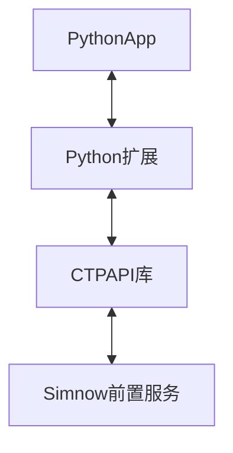

# openctp-ctp-python

openctp-ctp-python 的目的是方便使用 Python 对接 [CTPAPI]() .

## 安装

CTPAPI 6.6.7

```shell
pip install openctp-ctp-667
```

CTPAPI 6.6.9

```shell
pip install openctp-ctp-669
```

## 代码示例

- 行情 [demo](demo/mdapi.py)
- 交易 [demo](demo/tdapi.py)

## 主要特性

- 支持多版本 CTPAPI
    - 6.3.15
    - 6.3.19
    - 6.5.1
    - 6.6.1
    - 6.6.7
    - 6.6.9
- 支持多版本 Python (3.7 ~ 3.11)
- 支持多平台
    - Windows
    - Linux
    - Mac (支持行情)

## 设计

利用 [SWIG]()及CTPAPI库生成Python扩展库, 转换流程参考[Python-CTPAPI](https://github.com/nicai0609/Python-CTPAPI).


