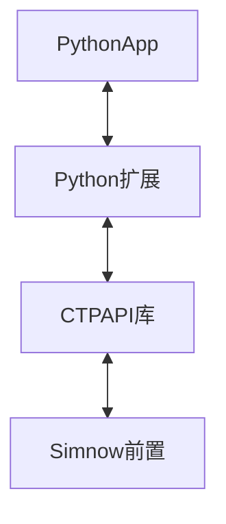

<p align="center">     
    <a href="http://www.sfit.com.cn/5_2_DocumentDown_6.htm" target="_blank">
        
    </a>       
    <a href="#">         
          
    </a>        
    <a href="#">     
                  
    </a> 
</p>

<p align="center">               
    <a href="https://pypi.org/project/openctp-ctp-6315" target="_blank">                  
             
    </a>     
    <a href="https://pypi.org/project/openctp-ctp-6319" target="_blank">                           
                  
    </a>
    <a href="https://pypi.org/project/openctp-ctp-651" target="_blank">                                    
                       
    </a> 
</p>
<p align="center">  
    <a href="https://pypi.org/project/openctp-ctp-661" target="_blank">                                             
                            
    </a> 
    <a href="https://pypi.org/project/openctp-ctp-667" target="_blank">                                             
                            
    </a> 
    <a href="https://pypi.org/project/openctp-ctp-669" target="_blank">                                             
                            
    </a> 
</p>

<p align="center">  
    <a href="https://github.com/Jedore/openctp-ctp-python/actions" target="_blank">                                                      
                                 
    </a> 
    <a href="https://github.com/Jedore/openctp-ctp-python/blob/main/LICENSE" target="_blank">                                                               
                                      
    </a> 
</p>

<p align="center">          
    <em>:rocket:以 Python 的方式，简化对接 SimNow 的过程，节省精力，快速上手</em>  
</p>

-----

## 项目说明:golf:
上期技术提供了 C++ 版本的 CTPAPI, 同时提供了 simnow 平台以供测试。 限于 C++ 本身的复杂度，有热心网友根据 CTPAPI 生成了 Python 版本的 Python-CTPAPI。 若要使用 Python-CTPAPI 需要手动执行一些配置操作，对于新手来说，仍然不够友好。

**本项目的目标便是将 Python-CTPAPI 打包上传到 PyPi平台，可以使用 `pip install ...` 的形式，轻松安装使用 Python-CTPAPI 对接 simnow**。
关于 Python-CTPAPI 可以参考 [openctp-ctpapi-python](https://github.com/openctp/openctp/tree/master/ctpapi-python) 及 [Python-CTPAPI](https://github.com/nicai0609/Python-CTPAPI)，本项目中的部分动态库也是来自以上两个项目或根据相同思路而产生。

限于精力有限，本项目只是进行了 Python版CTPAPI 的打包上传及简单的连接测试，正式使用前请一定进行充分的测试。

## 安装:hammer_and_wrench:

```shell
# pip install openctp-ctp-<ctp version>
pip install openctp-ctp-6319
pip install openctp-ctp-667
```

## 代码示例:man_technologist:

```python
from openctp_ctp_667 import mdapi, tdapi

md_api = mdapi.CThostFtdcMdApi.CreateFtdcMdApi("market")
td_api = tdapi.CThostFtdcTraderApi.CreateFtdcTraderApi('user_id')
```

- 行情 [demo](demo/mdapi.py)
- 交易 [demo](demo/tdapi.py)

## 功能:zap:

- 支持多版本 CTPAPI
    - 6.3.15_20190220
    - 6.3.19_P1_20200106
    - 6.5.1_20200908
    - 6.6.1_P1_20210406
    - 6.6.7_20220613
    - 6.6.9_20220920
- 支持多版本 Python (3.7 ~ 3.11)
- 支持多平台
    - Windows_x64
    - Linux_x64
    - Mac_x64 (支持行情)

## 核心:art:

利用 [SWIG](https://www.swig.org/)及 [CTPAPI](http://www.sfit.com.cn/5_2_DocumentDown_6.htm) 库生成Python扩展库



> 转换流程主要参考[Ralph Jing](https://github.com/nicai0609)的[Python-CTPAPI](https://github.com/nicai0609/Python-CTPAPI),感谢:pray:

## 更多信息:page_facing_up:

- [openctp](https://github.com/openctp/openctp)
- [openctp-tts-python](https://github.com/Jedore/openctp-tts-python)
- QQ交流群 127235179
